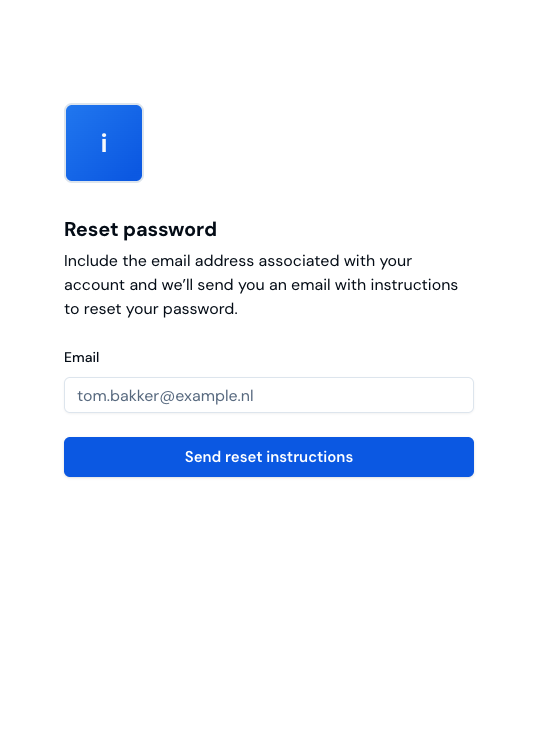
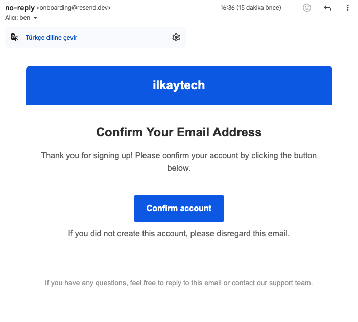
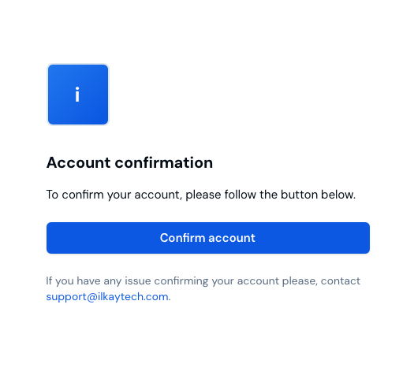
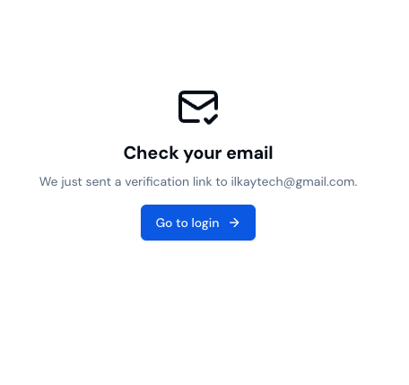
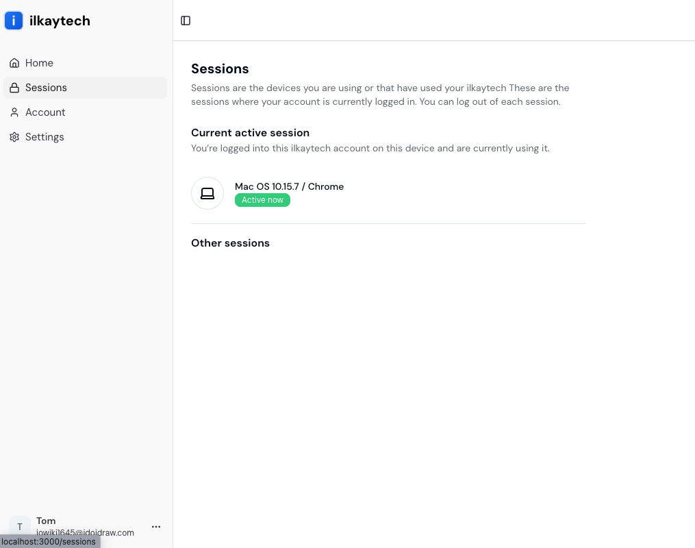
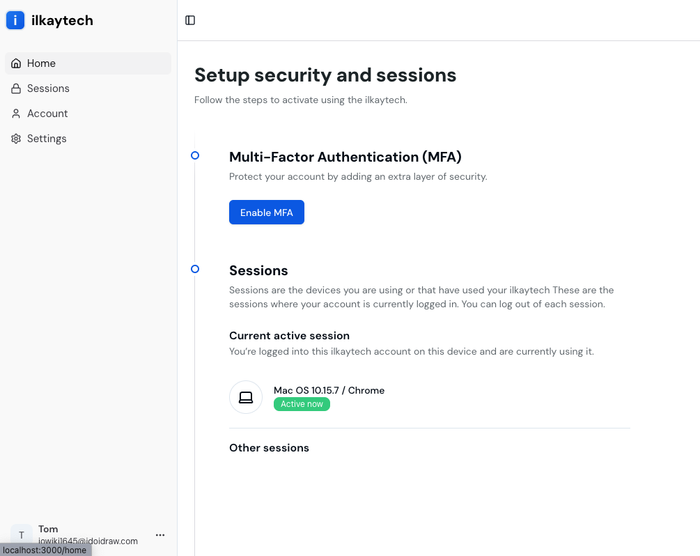
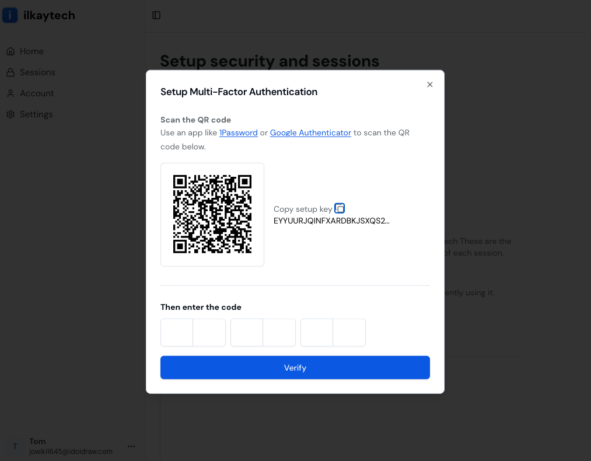
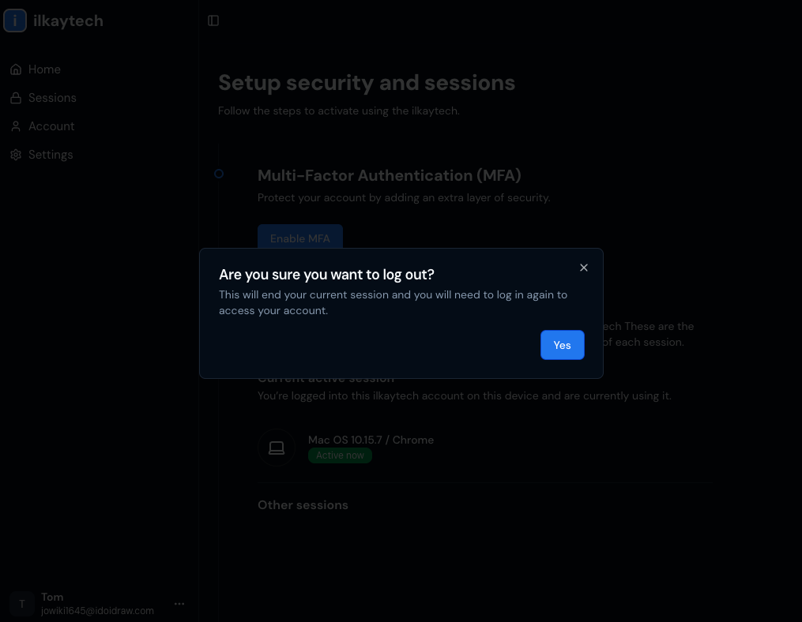

# 🔐 Advanced Authentication System with Node.js, TypeScript, 2FA, JWT, Sessions & Next.js

A full-stack, secure authentication boilerplate built using **Node.js**, **Express**, **TypeScript**, and **Next.js**. It includes modern auth features like **email verification**, **2FA**, **access & refresh tokens**, **cookie-based sessions**, and more — all production-ready.

---

## 🗝️ Key Features

### 🔧 Backend (Node.js + Express + TypeScript)

- 🧩 **Modular Architecture** — Clean, scalable folder structure
- 📦 **MongoDB (Mongoose)** for schema modeling
- 🔐 **User Registration & Login**
- 📧 **Email Verification with Resend**
- 🔁 **Password Reset via Email**
- 🔑 **Access & Refresh Tokens (JWT)**
- 🍪 **Secure Cookies for Session Management**
- 📲 **Two-Factor Authentication (2FA)** using `speakeasy` and `qrcode`
- 🛡️ **Passport.js with JWT strategy**
- 📉 **Rate Limiting** middleware for brute-force protection
- 🗂️ **Environment-based Config with dotenv**
- 📜 **Validation with Zod**

---

### 💻 Frontend (Next.js + TypeScript + Tailwind CSS)

- 🖥️ **Reusable Auth Forms** (Sign up / Login)
- ✅ **Email Confirmation Page**
- 🔒 **Protected Routes with Middleware**
- 🏠 **User Dashboard with Session Info**
- 📲 **2FA Setup & Verification Flow**
- 💼 **Active Session Tracking & Management**
- 🚪 **Logout with Secure Session Termination**
- 🌗 **Light & Dark Mode UI**

---

## 🚀 Getting Started

### Backend

```bash
cd backend
npm install
npm run dev
```

> Create a `.env` file and set up Mongo URI, JWT secrets, Resend API key, etc.

### Frontend

```bash
cd frontend
npm install
npm run dev
```

---

## 📌 Tech Stack

- **Backend**: Node.js, Express, MongoDB, TypeScript, Passport, JWT
- **Frontend**: Next.js, React, Tailwind CSS
- **Security**: Bcrypt, JWT, 2FA, Cookie-based auth, Rate limiting
- **Utilities**: Zod, Resend, dotenv, qrcode

---

📸 Application Screenshots

<p align="center"> <a href="screenshots/Sign in.png" target="_blank"></a> <a href="screenshots/Sign up.png" target="_blank"></a> <a href="screenshots/Reset-password.png" target="_blank"></a> <a href="screenshots/confirm-your-email.png" target="_blank"></a> <a href="screenshots/account-confirmation.png" target="_blank"></a> <a href="screenshots/check-your-email.png" target="_blank"></a> <a href="screenshots/session-list.png" target="_blank"></a> <a href="screenshots/dashboard_1.png" target="_blank"></a> <a href="screenshots/2FA-Setup.png" target="_blank"></a> <a href="screenshots/Log-out.png" target="_blank"></a> <a href="screenshots/dark-mode.png" target="_blank"></a> </p>
